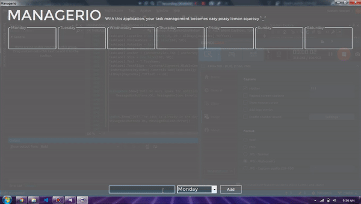

# Managerio (Under Development)

It's a simple task management app (if you know Trello, then it's the same but minimal version) which lets you add or remove tasks on the go for each separate day. They gets saved even when the app is closed and (after first run) it starts with Windows reminding you the tasks you need to do.

Make your task management easy with this tool and yes.. Suggestions are welcomed

## Adding a Task
Tasks are added using a buttons

